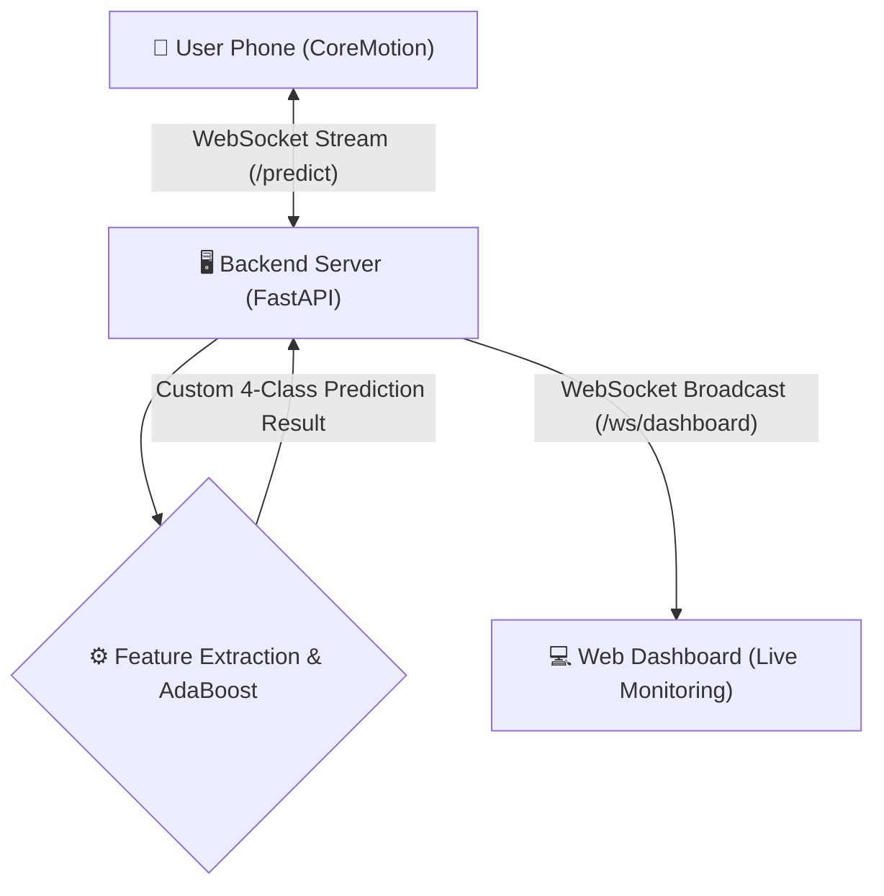

# Smartphone Placement Detection

Have you ever wondered where your phone was when you were walking with your phone in your hand or in your pocket? .... Yeah, me neither.

This app tells you anyways.

It builds on top of a great [research](https://www.researchgate.net/publication/404894660_Smartphone_Placement_Recognition_during_Walking_Performance_Determinants_and_Real-World_Generalizability).

The paper focuses on 6 - 4 different classes, and this builds on top of that, uses the MATLAB trained model (I was not able to train them for their data was not available). But played around a lot with the model itself, which can be found in `server/test_models.ipynb`. tl;dr to make it more useful to regular people, by testing with different combinations and machine unlearning techniques, it was concluded merging certain categories that may get often confused would make it more practical.

Hence the app uses 4 classes

- **Hand-held** (`H`)
- **Back Pocket** (`BP`)
- **Front Pocket** (`FP`)
- **Shoulder Bag** (`SB`)

This is how the UI looks (the app and the web dashboard):

<p align="center" style="display: flex; align-items: center; justify-content: center;">
  
  
</p>

## System Design and Architecture

The live prediction framework streams data from the user's phone to the backend for real-time classification:



### Architecture Components

<br>
The most interesting part of the app is the **Backend Server**. The backend starts a **WebSocket** session and waits. It receives IMU data from the phone every second. It buffers data for 10 seconds and then computes L2 norm magnitudes and extracts 50 distinct time and frequency-domain features. Then it runs it through the AdaBoost Decision Tree Ensemble to predict the phone's placement.

<br>
anyways, here some more detailed lines about the architectural compoenents:
</br>
</br>

1. **iOS App (SwiftUI & CoreMotion):**
    - Collects continuous **Accelerometer** and **Gyroscope** data at **100 Hz** using Apple's CoreMotion framework.
    - Buffers the data and streams it as JSON payloads to the backend over a persistent WebSocket connection.
    - Features a premium, real-time UI that dynamically updates to display the backend's inferred placement.

2. **Backend Server (FastAPI):**
    - Acts as the central hub, managing bidirectional WebSocket connections for streaming smartphones (`/predict`) and live monitoring dashboards (`/ws/dashboard`).
    - **Data Preprocessing:** Parses raw iOS CoreMotion payloads (handling both combined `motion` arrays and separate `accelerometer`/`gyroscope` streams). It converts accelerations from G's to $m/s^2$, computes orientation-invariant L2 norm magnitudes, and standardizes the time-series by resampling it to exactly **100 Hz** over a **10-second rolling window** (1000 samples).
    - **Feature Extraction (`feature_utils.py`):** Translates the raw waves into 50 distinct metrics used for walking gait analysis. The features span:
        - *Statistical & Time-Domain:* Mean, Variance, Skew, Kurtosis, RMS, Jerk RMS, Autocorrelation, Multiscale Entropy, and Teager Energy Operator (TEO).
        - *Frequency-Domain:* FFT-based Dominant Power, Spectral Entropy, Mean/Median frequencies, and Harmonic Ratios.
        - *Time-Frequency:* Continuous Wavelet Transform (CWT) evaluating energy and entropy across 8 distinct frequency bands (0.5 Hz to 25 Hz).
    - **Inference (`model.py`):** Feeds the feature vector into a custom Python implementation of an **AdaBoost Decision Tree Ensemble**. It intercepts the model's native 6-class output, merges the probabilities into our 4-class taxonomy, normalizes them to exactly 1.0, and broadcasts the result globally.

3. **Machine Learning Model:**
    - Evaluates the extracted features to determine the phone's physical placement.
    - The system is optimized for a robust **4-class taxonomy**, yielding ~93.4% accuracy:
        - **Hand-held** (`H`)
        - **Back Pocket** (`BP`)
        - **Front Pocket** (`FP`)
        - **Shoulder Bag** (`SB`)

4. **Web Dashboard (Vanilla JS/CSS):**
    - Served directly by FastAPI at `/dashboard`.
    - Connects to the backend via a secondary broadcast WebSocket (`/ws/dashboard`).
    - Replicates the iOS application's glassmorphic, dark-mode aesthetic to allow users to monitor the live phone placement from any browser in real-time.

---

## How to Run

### 1. Setup the Backend Server
First, download or clone the repository to your machine. Then, open your terminal and navigate to the `server` directory to get the backend running:

```bash
cd server
./start_server.sh
```
*This script will automatically set up the Python virtual environment for background workers, build the Go backend, and start the server. You can visit `http://localhost:8000/dashboard` in your browser to view the live dashboard!*

### 2. Run the iOS App
1. Open Xcode and open the `PhonePlacementApp.xcodeproj` file located inside the `PhonePlacementApp` directory.
2. **Sign the App:** 
   - Click on the `PhonePlacementApp` project in the left-hand Project Navigator.
   - Go to the **Signing & Capabilities** tab.
   - Select your Personal Apple ID in the **Team** dropdown (you may need to add your account in Xcode Preferences first).
   - Ensure the Bundle Identifier is unique if you encounter any bundle conflicts.
3. **Deploy:** Attach your physical iPhone to your Mac via USB (or wireless connection).
4. At the top of the Xcode window, change the run destination from a simulator to your physical iPhone.
5. Hit the **Run** (▶) button to build and install the app.
6. **Trust the Developer:** The first time you install an app you built yourself, iOS will block it for security. On your iPhone, go to **Settings > General > VPN & Device Management > Developer App**, and tap **Trust**.
7. Open the **WhereMyPhoneAt** app on your phone, and hit **Start** to begin streaming your IMU data!

> [!NOTE]
> **Network & Firewall:** Since your iPhone will be streaming data to your Mac over your local Wi-Fi network, ensure that both devices are on the same network. You may need to grant local network permissions or temporarily adjust your Mac's firewall settings if the connection is blocked. Ensure the app is pointing to your Mac's local IP address!

### 3. View the Live Dashboard
Once the app is running and connected, simply open your favorite web browser on your computer and navigate to:
`http://localhost:8000/dashboard`

You'll see a real-time web dashboard mimicking the app's premium UI, instantly updating with the model's live predictions!
