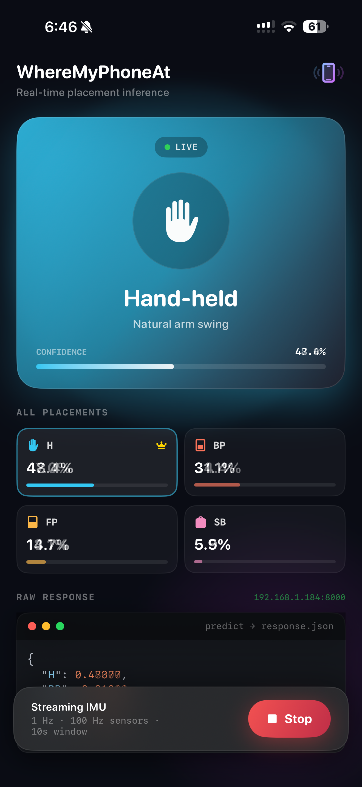
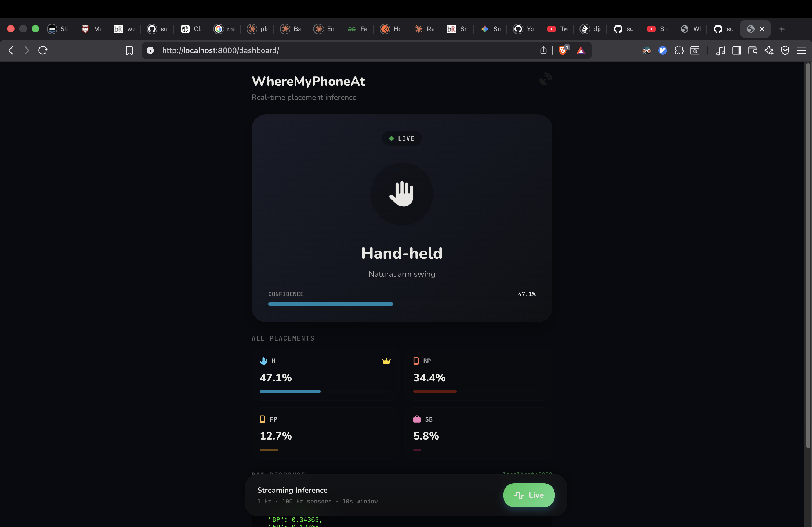
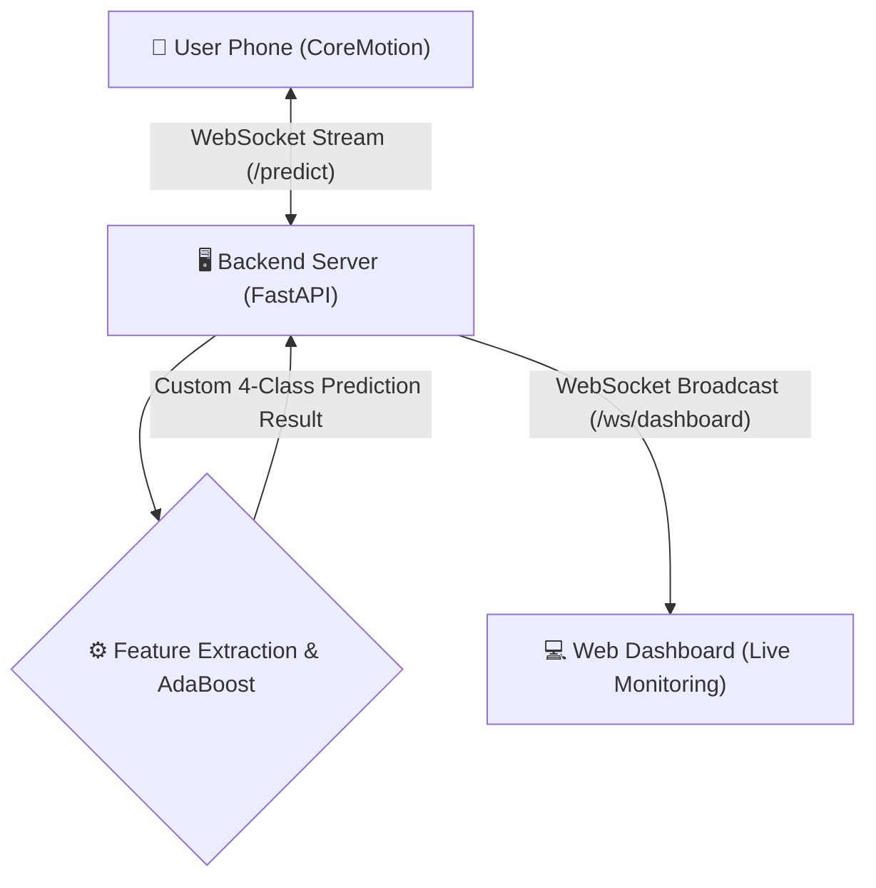

# Smartphone Placement Detection

Have you ever wondered where your phone was when you were walking with your phone in your hand or in your pocket? .... Yeah, me neither.

This app tells you anyways.

It builds on top of a great [research](https://www.researchgate.net/publication/404894660_Smartphone_Placement_Recognition_during_Walking_Performance_Determinants_and_Real-World_Generalizability).

The paper focuses on 6 - 4 different classes, and this builds on top of that, uses the MATLAB trained model (I was not able to train them for their data was not available). But played around a lot with the model itself, which can be found in `server/test_models.ipynb`. tl;dr to make it more useful to regular people, by testing with different combinations and machine unlearning techniques, it was concluded merging certain categories that may get often confused would make it more practical.

Hence the app uses 4 classes

- **Hand-held** (`H`)
- **Back Pocket** (`BP`)
- **Front Pocket** (`FP`)
- **Shoulder Bag** (`SB`)

This is how the UI looks (the app and the web dashboard):

  
  

## System Design and Architecture

The live prediction framework streams data from the user's phone to the backend for real-time classification:

### Architecture Components

 
The most interesting part of the app is the **Backend Server**. The backend starts a **WebSocket** session and waits. It receives IMU data from the phone every second. It buffers data for 10 seconds and then computes L2 norm magnitudes and extracts 50 distinct time and frequency-domain features. Then it runs it through the AdaBoost Decision Tree Ensemble to predict the phone's placement.

 
anyways, here some more detailed lines about the architectural compoenents:
 
 

1. **iOS App (SwiftUI & CoreMotion):**
    - Collects continuous **Accelerometer** and **Gyroscope** data at **100 Hz** using Apple's CoreMotion framework.
    - Buffers the data and streams it as JSON payloads to the backend over a persistent WebSocket connection.
    - Features a premium, real-time UI that dynamically updates to display the backend's inferred placement.

2. **Backend Server (FastAPI):**
    - As mentioned above, it manages WebSocket connections for both the streaming smartphones and the live dashboards.
    - It maintains a **10-second rolling window** of IMU data. Once 10 seconds of data is buffered, it computes L2 norm magnitudes and extracts 50 distinct time and frequency-domain features.
    - Executes inference using a custom Python implementation of an **AdaBoost Decision Tree Ensemble** (originally trained in MATLAB).

3. **Machine Learning Model:**
    - Evaluates the extracted features to determine the phone's physical placement.
    - The system is optimized for a robust **4-class taxonomy**, yielding ~93.4% accuracy:
        - **Hand-held** (`H`)
        - **Back Pocket** (`BP`)
        - **Front Pocket** (`FP`)
        - **Shoulder Bag** (`SB`)

4. **Web Dashboard (Vanilla JS/CSS):**
    - Served directly by FastAPI at `/dashboard`.
    - Connects to the backend via a secondary broadcast WebSocket (`/ws/dashboard`).
    - Replicates the iOS application's glassmorphic, dark-mode aesthetic to allow users to monitor the live phone placement from any browser in real-time.
